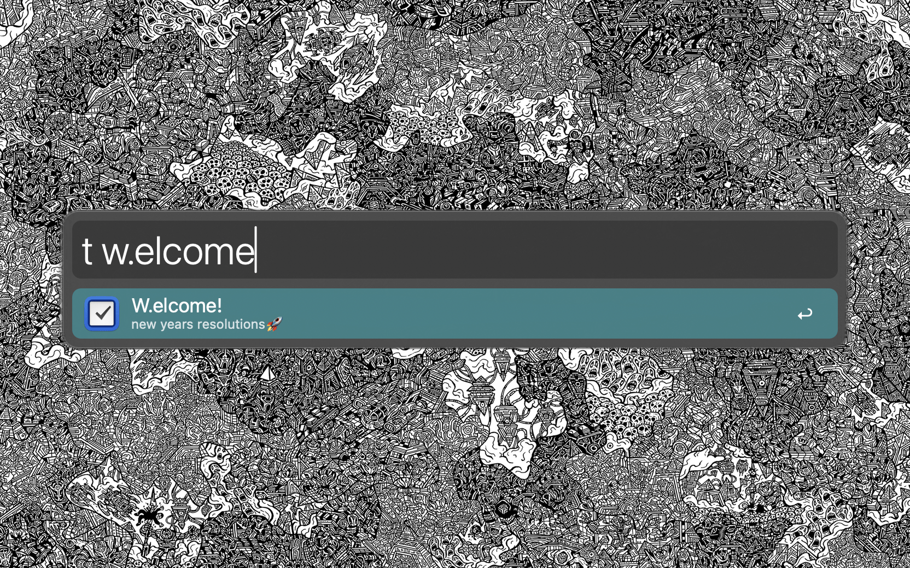
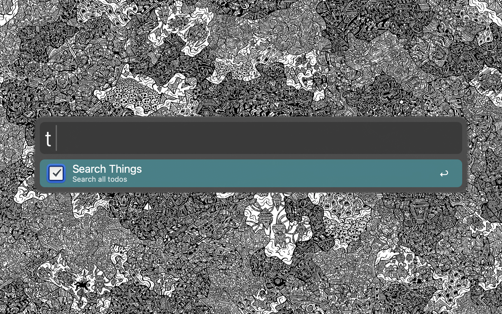

# Search Things, Powerfully (Alfred Workflow)

Search Things as if you were there, except in Alfred.

## Usage

Find Todos using match search, via the keyword "ths" (User-changeable).
Select a todo and get brought to its location in the things app.

## Dependencies

All of the below can be installed with one simple command:
'brew install luajit luarocks'
(The libraries are default bundled)

- luaJIT (Ensure this is installed on your system)
- luarocks
- Libraries
    - https://luarocks.org/modules/tomasguisasola/luasql-sqlite3
    - https://luarocks.org/modules/jiyinyiyong/json-lua

## Finding Things Database Path

- Ensure that you have "Show hidden files on" in Finder
- Then, enter Library -> Group Containers -> (WEIRD NUMBER STRING)com.culturedcode.Thingsmac -> ThingsData(MORE NUMBERS) -> (something)database(something) -> RIGHT CLICK ON IT -> "Show package contents"
- Then you need to select main.sqlite - Basic solution: While selected, go to the Edit menu -> copy as pathname
  Yay!!!!
